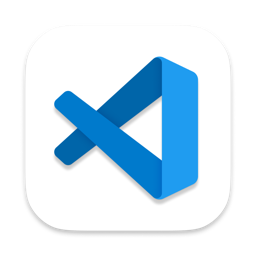
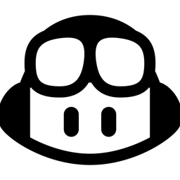

<p align="center">
  
  &nbsp;&nbsp;
  
  &nbsp;&nbsp;
  
  &nbsp;&nbsp;
  
  &nbsp;&nbsp;
  
</p>

<h1 align="center">MX Master 4 Haptics</h1>

<p align="center">
  Buzzes your <strong>MX Master 4</strong> when an agent does stuff.
  Cursor · VS Code · Copilot CLI · Claude Code.
  Powered by <a href="https://haptics.jmw.nz/">HapticWeb</a> in Logi Options+.
</p>

## You need

1. An [MX Master 4](https://www.logitech.com/)
2. [Logi Options+](https://www.logitech.com/software/logi-options-plus.html) running
3. The [Haptic Web](https://marketplace.logi.com/plugin/HapticWeb/en) plugin installed in Options+
4. Node.js 18+ (you already have it if you use `npx`)

Quick check that HapticWeb is up:

```bash
curl -sS https://local.jmw.nz:41443/
curl -sS -X POST -d '' https://local.jmw.nz:41443/haptic/completed
```

Second one should make the mouse buzz.

## Install

### Cursor

```bash
npx cursor-hook install kevinrodriguez-io/agentic-haptic
```

Pick **global** (`~/.cursor`) if you want it everywhere.

From a local clone:

```bash
npx cursor-hook install /path/to/agentic-haptic
```

#### Manual (Cursor)

```bash
mkdir -p ~/.cursor/hooks
cp -R hooks/mx-master-haptic ~/.cursor/hooks/
```

Then copy the bits from [`hooks.json.example`](./hooks.json.example) into `~/.cursor/hooks.json`. Keep `"version": 1`.

### VS Code (agent plugins)

VS Code **agent plugins** (Copilot Chat agents + hooks), not a classic Marketplace extension.

1. Extensions view → search `@agentPlugins`, **or** Command Palette → **Chat: Plugins**
2. Install from source / Git URL:
   ```
   https://github.com/kevinrodriguez-io/agentic-haptic
   ```
3. Enable `mx-master-haptic` if needed
4. Use an **agent** chat session

See [Agent plugins in VS Code](https://code.visualstudio.com/docs/copilot/customization/agent-plugins) (Preview).

### GitHub Copilot CLI

Terminal Copilot agent (`copilot`), separate from the VS Code UI.

```bash
copilot plugin install kevinrodriguez-io/agentic-haptic
```

Or from a local clone:

```bash
copilot plugin install /path/to/agentic-haptic
# re-run after changes; the CLI caches plugins
```

Check: `copilot plugin list`

### Claude Code

```bash
claude plugin marketplace add kevinrodriguez-io/agentic-haptic
claude plugin install mx-master-haptic@mx-master-haptic
```

Try it for one session without installing:

```bash
claude --plugin-dir /path/to/agentic-haptic
```

#### Manual (Claude Code)

Merge [`examples/claude-settings.json`](./examples/claude-settings.json) into `~/.claude/settings.json` (or project `.claude/settings.json`). Replace `/ABSOLUTE/PATH/TO/agentic-haptic` with your clone path.

## What fires what

### Cursor

| Hook | Waveform | When |
|------|----------|------|
| `stop` | `completed` | Agent turn is done |
| `afterAgentResponse` | `knock` | A reply lands |
| `postToolUseFailure` | `angry_alert` | A tool blows up |
| `subagentStop` | `sharp_state_change` | Subagent finishes |

### VS Code / Copilot CLI

| Hook | Waveform | When |
|------|----------|------|
| `agentStop` (`Stop` in VS Code) | `completed` | Agent turn is done |
| `postToolUseFailure` | `angry_alert` | A tool blows up |
| `subagentStop` | `sharp_state_change` | Subagent finishes |

### Claude Code

| Hook | Waveform | When |
|------|----------|------|
| `Stop` | `completed` | Agent turn is done |
| `PostToolUseFailure` | `angry_alert` | A tool blows up |
| `SubagentStop` | `sharp_state_change` | Subagent finishes |

Waveform list is [here](https://haptics.jmw.nz/integrate).

## Optional

```bash
export HAPTIC_WEB_URL=https://local.jmw.nz:41443
```

## Test

```bash
echo '{}' | node hooks/mx-master-haptic/haptic.js completed
echo '{}' | node scripts/run-haptic.js completed
```

Or run an agent turn. When it finishes, you should feel it.

Stuck?

- Cursor: **Customize → Hooks** or **View → Output → Hooks**
- VS Code: **Developer: Show Agent Debug Logs**, or Extensions → Agent Plugins
- Copilot CLI: `copilot plugin list`
- Claude Code: `/plugin` · `/hooks`

## Uninstall

**Cursor**

```bash
rm -rf ~/.cursor/hooks/mx-master-haptic
# also delete the haptic entries from ~/.cursor/hooks.json
```

**VS Code**

Extensions → Agent Plugins → uninstall `mx-master-haptic`

**Copilot CLI**

```bash
copilot plugin uninstall mx-master-haptic
```

**Claude Code**

```bash
claude plugin uninstall mx-master-haptic@mx-master-haptic
```

## How it works

```
agent event (stop / agentStop / Stop / ...)
        ↓
hook runs node scripts/run-haptic.js  (or haptic.js on Cursor)
        ↓
POST https://local.jmw.nz:41443/haptic/{waveform}
        ↓
HapticWeb (inside Options+)
        ↓
MX Master 4 buzzes
```

## License

MIT
